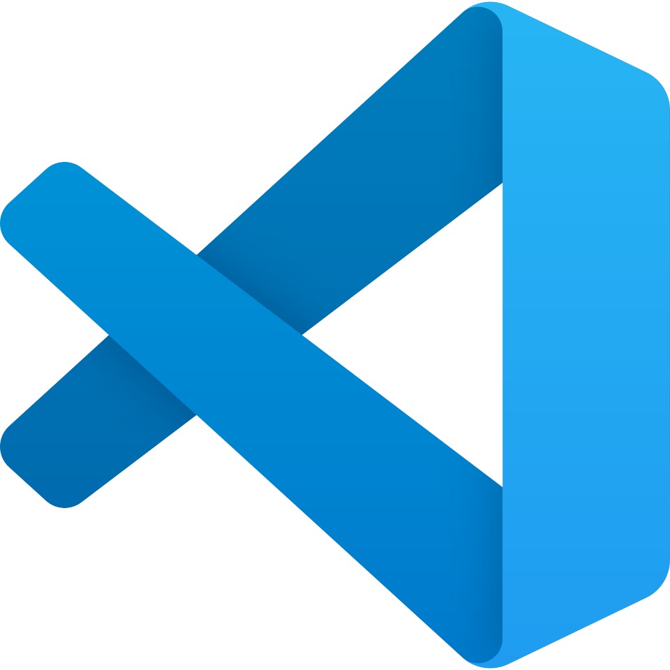
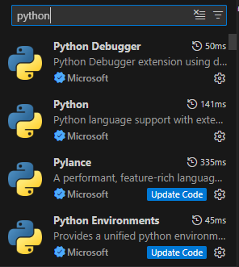

# Estudo Python
## Estudo da lignuagem python para a aplicação dos conceitos de lógica de programação

<p align="center">


</p>

### Utilização do Python
Para usar a linguagem de programação Python, será necessário fazer a instalação da linguagem. Abaixo o link para download:

<a href="https://python.org">Download Python</a>

### Utilização do Python no VSCode
Depois de instalado o Python, você deve instalar a extensão do Python:
<p align="center">

</p>

#### Primeiro comando em Python

``` python
print("Hello, World")
```
